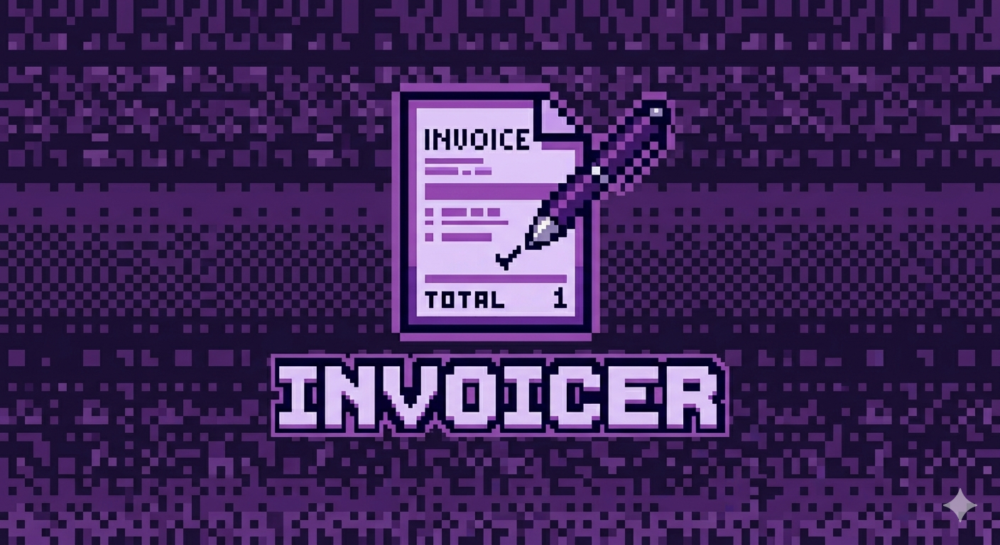

# Invoicer

<p align="center">
  
</p>

**An invoicing tool for people who bill under more than one name.**

Create professional invoices, generate PDFs, manage clients and brands, and track follow-ups. Sign in with a magic link or Google; your data lives in your own account, in Postgres, and is reachable from any device you sign in on.

> **This used to be a local-first app.** Earlier versions stored everything in your browser's `localStorage` and never talked to a server. That is no longer true, and the change is not reversible from inside the app — see [Moving from the local-only version](#moving-from-the-local-only-version) if you have data from one of those builds.

> **What's real and what isn't:** everything above the line is fully functional. Two things in this build are deliberate facades and are labelled `MOCK:` at every relevant call site in the source — see [What's Not Implemented](#whats-not-implemented) below before you rely on either.

---

## Navigation

The sidebar has six destinations:

| Destination | What it does |
|---|---|
| **Dashboard** | All invoices across every brand, with status tabs (All / Paid / Sent / Draft / Overdue), search, pagination, revenue chart, and headline stats (revenue, outstanding, overdue, collection rate). |
| **Invoices** | The sidebar entry is a shortcut to **New Invoice**; every invoice's own page (opened from the dashboard) is where you view, edit, mark paid, and manage its follow-ups. |
| **Brands** | The businesses you invoice from — name, address, GST/PAN, bank details, logo, invoice number prefix, and per-brand follow-up defaults. |
| **Clients** | The businesses and individuals you bill, saved once and auto-filled onto new invoices. |
| **Follow-ups** | Per-brand reminder schedules, the queue of what's going out next, reminder history per invoice, and the email templates reminders are built from. |
| **Reports** | Financial-year summaries (grouped by currency, exportable as a PDF) and full data import/export. |

Signing in happens at `/login`. There is no Settings screen — Reports takes its place in the nav.

---

## Features

### Invoices

- **Line items** with per-item tax rates, descriptions, and amounts
- **Multi-currency** — INR (₹), USD ($), SGD (S$) — set per invoice
- **Status lifecycle** — `Draft → Sent → Paid / Overdue`
- **Draft editing** — drafts stay fully editable; every status can be edited from its detail page, though `Draft` is the only status the app itself promotes you toward changing before sending
- **Mandatory field validation** — required fields are marked and validated before an invoice is finalized; drafts can be saved with partial data
- **A frozen brand snapshot** — a brand's name, address, logo, bank details, etc. are copied onto the invoice at creation time, so editing the brand later never changes an invoice already issued
- **PDF export** — print-ready PDF with your brand logo, invoice number, line items, tax breakdown, bank details, and notes

### Brands

Each brand represents a business you invoice from. The free tier supports one; adding more is behind the mock Pro upsell (see below).

- Name, address, email, and phone
- GST and PAN numbers
- Logo — stored locally as base64, embedded in generated PDFs and in every invoice's frozen snapshot
- Bank details — account number, IFSC, branch, UPI ID — printed on every PDF
- Invoice number prefix — e.g. prefix `SC` produces `SC-2026-001`, `SC-2026-002`, ...
- An accent colour and a default follow-up schedule, both editable per brand

### Clients

Save the businesses and individuals you bill regularly.

- Company name, contact name, address, email, phone, and GST number
- Auto-fill any saved client when creating a new invoice
- Optionally save a new client directly from the invoice form

### Follow-ups

Schedule reminder emails per brand, per unpaid invoice.

- Each brand has its own schedule (weekly, or a specific weekday and time) and a cap on how many reminders to send before giving up
- A queue view shows what's going out next, across every brand
- Every invoice keeps its own reminder history, and follow-ups can be paused per invoice
- Reminder emails are built from reusable templates (subject, tone, body) with placeholders like `{{client}}`, `{{invoice}}`, `{{amount}}`
- **Nothing is ever actually sent.** See [What's Not Implemented](#whats-not-implemented).

### Reports

- **Financial-year summary** — every invoice in a chosen FY and month range, grouped by currency, filterable by brand and status, exportable as a PDF
- **Export** — downloads a timestamped JSON file containing all invoices, brands, clients, and templates
- **Import** — restores data from a previously exported file
- **Conflict resolution** — if an imported invoice number already exists, you choose per-conflict: overwrite, rename (with a new number), or discard

### Dashboard

- All invoices, filterable by status tab, searchable, paginated
- Total amounts broken out by currency when multiple currencies are in use
- A 12/6/3-month revenue chart
- Quick-access links to create invoices, brands, and clients

---

## What's Not Implemented

Two features look and behave like real product surfaces but are deliberately mock. Every place a reader could otherwise mistake either for the real thing carries a `MOCK:` comment in the source (`grep -rn "MOCK:" src/` finds all of them).

- **Billing / Pro.** The plan card, the "Pro" pills next to gated features, the upsell dialog, and the `₹499/mo` line are all cosmetic. `usePlan().upgrade()` just flips a flag in `localStorage` — **no payment provider is called and no card is ever collected.** "Upgrading" instantly unlocks the gated feature (multiple brands) for free.
- **Email sending.** Follow-ups schedule reminders, queue them, and record a history of when a reminder was "sent" — all of it real and persisted. **No email is ever actually transmitted.** "Send one now" on an invoice just appends today's date to that invoice's reminder history and shows a toast as if it had gone out. A real implementation would need a backend with a scheduler and a mail provider, neither of which exists here.
- **Settings.** No functional Settings screen exists; Reports takes its place in the nav.

Auth is no longer on this list: sign-in, sessions and sign-out are real. Billing and email sending are still facades — treat the Pro tier and every follow-up "sent" timestamp as illustrative, not real.

---

## Getting Started

### Prerequisites

- Node.js 18+ and npm
- Docker, for the local Supabase stack
- Supabase CLI 2.81.3+

### Development

```bash
git clone https://github.com/sivansundar/invoicer.git
cd invoicer
npm install
supabase start   # first run pulls images and takes a few minutes
npm run dev
```

Open [http://localhost:3000](http://localhost:3000).

This project does **not** use Supabase's default ports, so it can run alongside another Supabase project — see [`docs/LOCAL-DEV.md`](docs/LOCAL-DEV.md) for the port map, the two env files you need, and how to sign in locally via the mail catcher.

### Production Build

```bash
npm run build
npm start
```

### Docker

```bash
# Build and run (foreground)
docker compose up --build

# Run in the background
docker compose up --build -d

# Stop
docker compose down
```

Open [http://localhost:3001](http://localhost:3001).

> The Docker image uses Next.js standalone output — lightweight and self-contained with no external dependencies or environment variables required.

---

## How It Works

### 1 — Set up a Brand

Everything starts with a brand. Go to **Brands → New Brand** and enter your business details: name, address, contact info, GST/PAN, bank details, logo, accent colour, invoice number prefix, and a default follow-up schedule. The free tier supports one brand; a second is gated behind the mock Pro upsell.

### 2 — Add Clients *(optional)*

Go to **Clients → New Client** to save clients you invoice regularly. When creating an invoice, selecting a saved client auto-fills their details. You can also save a new client on the fly from the invoice form.

### 3 — Create an Invoice

Click **New Invoice** from the dashboard or sidebar. Select a brand, fill in the client details, set the currency, bill date, and due date, then add your line items with descriptions and per-item tax rates. Invoices start as **Draft**.

- Required fields (Brand, Bill Date, Due Date, Company Name) are marked with a red `*`
- Clicking **Create Invoice** validates required fields and scrolls to any that are missing
- **Save as Draft** is available once you've made any change — no required fields enforced

### 4 — Manage Status

Open an invoice to update its status, download its PDF, or manage its follow-ups:

| Status | Description |
|--------|-------------|
| `Draft` | Work in progress |
| `Sent` | Delivered to the client |
| `Paid` | Payment received — follow-ups stop automatically |
| `Overdue` | Past the due date, payment outstanding |

Promoting a draft to any non-draft status requires all mandatory fields to be filled.

### 5 — Follow Up on Unpaid Invoices

Turn on a brand's follow-up schedule (Brands → Edit, or the Follow-ups page) and every unpaid invoice from that brand joins the queue. Reminders are recorded against the invoice — nothing is sent (see [What's Not Implemented](#whats-not-implemented)) — and stop the moment the invoice is marked paid, or can be paused per invoice at any time.

### 6 — Download PDF

On any invoice page, click **Download PDF**. The generated PDF includes your brand logo, invoice number, dates, full line item table, subtotal, tax, total, bank details, and any notes.

### 7 — Generate Reports

Go to **Reports → Summary Report** to build a financial-year summary: pick a financial year and month range, optionally filter by brand and status, and export the result as a PDF grouped by currency.

### 8 — Back Up Your Data

Your data lives in your account, so a lost laptop is not a lost business. You should still keep your own copy: **Reports → Export** downloads a full backup — brands, clients, follow-up templates and invoices, in one file — and **Import** restores it. Brands, clients and templates whose `id` already exists are skipped (never overwritten), and conflicting invoice numbers are resolved one at a time. Backups written by the local-only version still restore, including the `invoices-<date>.json` files that predate the current format.

---

## Data Storage

Your brands, clients, invoices, line items and follow-up templates live in Postgres, scoped to your account. Every table is protected by row-level security, so the database itself — not application code — is what stops one account reading another's rows. Invoice numbers are allocated inside a transaction, so two tabs cannot issue the same number.

Two things are still kept in your browser, deliberately, because they are per-device preferences rather than data:

| `localStorage` key | Contents |
|--------------------|----------|
| `invoicer_theme` | Light/dark preference |
| `invoicer_brand_filter` | Which brand the dashboard is filtered to |
| `invoicer_plan` | The (mock) Pro/Free flag — see [What's Not Implemented](#whats-not-implemented) |

### Moving from the local-only version

Nothing is migrated automatically, and your local data is not touched. Earlier builds stored everything under `invoicer_*` keys in the browser; opening the hosted app leaves all of it exactly where it is.

If the app finds `invoicer_*` data in your browser after you sign in, it offers a one-time prompt — "We found *N* invoices on this device. Import them into your account?" — rather than asking you to export and re-import a backup by hand. Accepting normalises older record shapes on the way in and rewrites any record id the database will not accept, the same way a backup import does. Your local copy is left untouched either way: declining just dismisses the prompt, and accepting only offers to clear it afterward, once you've seen the result. The manual route (**Reports → Import**) still exists for a backup file exported from the old version, and behaves the same way.

One consequence worth knowing, true of both paths: because rewritten ids can't be matched against on a second pass, importing the same old data a second time adds a second copy of the affected records rather than skipping them. The import summary tells you when this applies.

### The v1 → v2 migration

This is the second schema this app has shipped. If you have data from an earlier version of Invoicer, it lacked several fields the current build depends on: a brand's accent colour and follow-up config, and an invoice's frozen brand snapshot, linked client, reminder history, and follow-up pause state.

This migration no longer runs on startup — it runs over the records in a backup file when you import one, so nothing rewrites data you have not chosen to bring across. What it does:

- Every brand is backfilled with a default accent colour and a default (enabled) follow-up schedule.
- Every invoice is backfilled with a frozen brand snapshot (reconstructed from the matching brand where possible), a best-effort link to a matching saved client, an empty reminder history, and follow-ups un-paused.
- **Existing invoice numbers are left exactly as they were.** An old-format number like `SC2026001` stays `SC2026001` — it may already be sitting in a client's inbox. Only invoices created after the migration get the current `SC-2026-001`-style numbering.
- Records that can't be migrated (not valid objects) are dropped from the live data but kept verbatim in a quarantine key for manual recovery, rather than silently discarded or allowed to break the whole migration.

Records that cannot be migrated are dropped from the import and counted in its summary rather than silently discarded.

---

## Tech Stack

| | |
|---|---|
| Framework | [Next.js 16](https://nextjs.org) — App Router, TypeScript |
| UI Components | [shadcn/ui](https://ui.shadcn.com) + [Radix UI](https://www.radix-ui.com) |
| Styling | [Tailwind CSS v4](https://tailwindcss.com) |
| PDF Generation | [@react-pdf/renderer](https://react-pdf.org) |
| Date Utilities | [date-fns](https://date-fns.org) |
| Database & Auth | [Supabase](https://supabase.com) — Postgres with row-level security, magic-link and Google sign-in |
| Data fetching | [TanStack Query](https://tanstack.com/query) |

### A note on lint config

`eslint.config.mjs` carries one scoped override: `@next/next/no-img-element` is turned off for `src/components/brands/brand-form.tsx` and `src/components/invoices/invoice-preview.tsx`, and nowhere else. Both render a brand's logo as a base64 data URI, not a remote or static asset — there's no origin for `next/image` to optimize against, and its data-URI support still requires `unoptimized` with none of the usual benefit (no CDN, no responsive `sizes`) for a small inline thumbnail. Everywhere else in the app, `next/image`/`<Image>` is used as normal.

---

## Contributing

Contributions are welcome. Please open an issue before submitting a pull request for anything beyond small fixes, so we can discuss the change first.

```bash
# Run the dev server
npm run dev

# Run tests
npm test

# Type-check
npx tsc --noEmit

# Lint
npm run lint

# Production build (run this before submitting a PR)
npm run build
```

---

## License

[MIT](./LICENSE)
